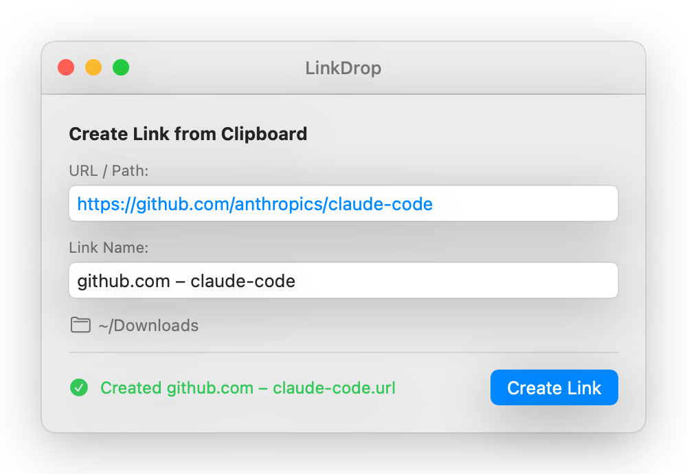

<p align="center">
  
</p>

<h1 align="center">LinkDrop</h1>

<p align="center">
  <strong>Instantly save links from your clipboard as files on macOS.</strong>
</p>

<p align="center">
  <a href="https://github.com/trsdn/link-drop/releases/latest"></a>
  <a href="LICENSE"></a>
  
  
  
  
  <a href="https://trsdn.github.io/link-drop/"></a>
</p>

---

## The Problem

You're researching something, jumping between browser tabs, Slack messages, documents. You find a link you want to keep. What do you do?

On macOS, creating a simple link file is **surprisingly hard**. There's no "Save Link As..." in most apps. You can't just right-click and create a shortcut like on other platforms. You end up pasting URLs into notes, bookmarks you'll never revisit, or text files with no structure.

If you organize things in folders — projects, research, bookmarks by topic — you want **links as files**. Clickable, movable, sortable. Just like any other file in Finder.

## The Solution

**LinkDrop** does one thing and does it well:

1. Copy a URL to your clipboard
2. Open LinkDrop
3. Hit <kbd>Cmd</kbd>+<kbd>Return</kbd>

That's it. A `.url` shortcut file appears in your Downloads folder (or wherever you configure). Double-click it anytime to open the link in your browser.

<p align="center">
  
</p>

## Features

- **Clipboard-first** — Automatically reads your clipboard on launch. No pasting needed.
- **Smart naming** — Derives a sensible filename from the URL (e.g., `github.com – claude-code.url`).
- **Works with everything** — Web URLs, `file://` paths, deep links. If it's a URL, LinkDrop handles it.
- **Configurable save folder** — Defaults to `~/Downloads`. Change it in Settings (<kbd>Cmd</kbd>+<kbd>,</kbd>).
- **Native macOS** — Built with SwiftUI. No Electron, no web views, no runtime dependencies.

<p align="center">
  
</p>

## Tiny Footprint

| Metric | Value |
|--------|-------|
| Binary size | **224 KB** |
| App bundle | **1.5 MB** (mostly the icon) |
| Source code | **213 lines** — single Swift file |
| Memory usage | **~15 MB** |
| Dependencies | **Zero** — just SwiftUI and AppKit |

No background processes. No auto-updates. No telemetry. Opens instantly, does its job, quits when you close it.

## Install

### Download

Grab the latest `.app` from [Releases](https://github.com/trsdn/link-drop/releases/latest), unzip, and drag to `/Applications`.

### Build from Source

Requires Xcode Command Line Tools and macOS 13+.

```bash
git clone https://github.com/trsdn/link-drop.git
cd link-drop
make build
make install  # copies to /Applications
```

## How .url Files Work

LinkDrop creates standard [`.url` internet shortcut files](https://en.wikipedia.org/wiki/URL_shortcut):

```ini
[InternetShortcut]
URL=https://github.com/trsdn/link-drop
```

Double-clicking a `.url` file in Finder opens the URL in your default browser. These files are tiny (under 100 bytes), cross-platform compatible, and work great with Spotlight search.

## License

[MIT](LICENSE)
